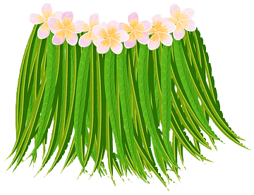
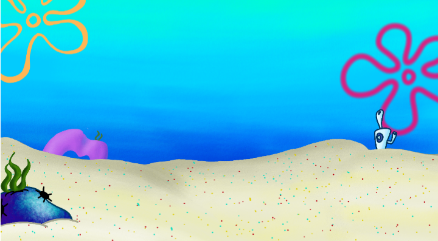

# Music Visualiser Project

Name:Wissam Hadjarab

Student Number: C21404706

Name: Iria Parada Murciego

Student Number: c22305863

github : iriaPM

class group: TU 856 /2

## Instructions
- Fork this repository and use it a starter project for your assignment
- Create a new package named your student number and put all your code in this package.
- You should start by creating a subclass of ie.tudublin.Visual
- There is an example visualiser called MyVisual in the example package
- Check out the WaveForm and AudioBandsVisual for examples of how to call the Processing functions from other classes that are not subclasses of PApplet

# Description of the assignment
For our group assignment we chose to do the music visualiser as a team. We chose the squidward tiki song from spongebob for a more light hearted visiualizer and stuck to the theme of spongebob throughout the different images.

# Instructions

# How it works
Wissam --
We initially worked on a seperate file each, one visiualiser each and designed and coded that section on our own.
For my file I included different elements whilst in line with the theme. I included a background of a grid along with an imported picture of the spongebob beach background too to give it more emphasis. 
I created a outline of the screen to go in beat and pulse with the song with different altitudes and colour to give more dimention and a 'pop' to add something to the screen that will stand out and resemble to frequencies of the audio.
I also wanted to include a moving element onto the screen and tried to keep it with theme so I decided to make an ocean wave based on one frequency wave from the audio. I 

Iria --
IriaVisual is composed of a background picture that everyone in the group has, to follow the spongebob theme; Then I have two sets of images one on the top half and the other one on the bottom half, they are tiki faces with a hawaiian skirt, these images are not directly from spongebob series but they are inspired by the ‘tikiland’ song sequence.  I used PImage to display the images onto the screen, I Initialise them in a method called tiki_face(), using Pvector I was able to position the images where I wanted them to be and also allow them to move up and down with the music, using the amplitude variable and ab.size(); 

```java

  // move tiki with music
  float amplitude = map(sin(frameCount * 0.05f), -1, 1, 0, ab.size() / 8);//
  PVector tikiPos = new PVector(tikiX, height / 12 + amplitude);//
  PVector tikiPos2 = new PVector(tikiX, height / 1.50f + amplitude);

  // skirt
  PVector skirtPos = new PVector(tikiX , height / 3.4f + amplitude);
  PVector skirtPos2 = new PVector(tikiX , height / 1.14f + amplitude);
```

The coconuts are also a big part of this visual, when cliked via mouse/touchscreen a coconut will appear on the screen and fall then go back up, once it reaches the bottom twice the coconut disappears(doesnt go back up). For this effect, I created an array to store all the coconuts that appear on screen,  I used a class  called ‘Coconut’, I used Pvector to also position the coconuts. Inside this class I made a method called update(), this is the method that updates the coconut position to make it appear on screen, I used pushmatrix() to save the current position of the coconut, then I made the coconut using two ellipses one for the brown part and another one for the little hole on the top corner. To make them fall I add 3 to the yposition.and then used an if statement making it go back up once it reaches the bottom, but once it reaches it twice the coconut gets removed from the array. 

```java

  pushMatrix(); // save the current transformation matrix
  translate(position.x, position.y); // translate to the coconut's position
  noStroke();
  fill(360, 100, 36);
  ellipse(0, 0, coconutSize, coconutSize); // draw coconut at the translated position

  // Draw small circle inside the coconut
  float smallCircleSize = 20;
  float smallCircleOffsetX = coconutSize / 2 - 30;
  float smallCircleOffsetY = -coconutSize / 2 + 30;
  fill(67, 37, 100);
  ellipse(smallCircleOffsetX, smallCircleOffsetY, smallCircleSize, smallCircleSize);

  popMatrix(); // restore the previous transformation matrix

  // makes coconut falls down
  position.y += 3;
  if (position.y > height) {
      position.y = 0; // coconut goes back up when it reaches the bottom
      timesReachedEnd++;
  }
  if (timesReachedEnd >= 2) {
      coconuts.remove(this); // remove coconut from the list if reached the end twice
  }
```

For the coconuts to appear on screen I made a method(outside of the coconut class), that used the built-in mousepressed function in an if statement and so add a coconut to the array in the position of the mouse, using mouseX, mouseY. this function is then called in draw() and i use get() to to display the coconut. 

```java
  public void reactToMouseMovement() {
        // make coconuts appear on screen when clicked by mouse
        if (mousePressed) {
            coconuts.add(new Coconut(new PVector(mouseX, mouseY)));// create new coconuts + add to list
        }
    }
```

In the center of the screen I have several elements, for them I used the lerped buffer and smoothed amplitude that we used in the labs to make the shapes expand with the music. 

The first shape is a line that using a for loop and adding cos and sin into the parameters make it this cool shape, that expands with the bass of the music. I also have a circle behind it that in the same way expands as the music gets louder. inside this circle I have a line that makes a circle inside it formed by multiple lines that change color with the music. For the use of color I used the HSB mode.

# List of classes/assets in the project
| Class/asset | Source |
|-----------|-----------|
|Squidward's Tiki Land Psy-Trance Remix.mp3	|From Youtube |
|Tiki_face.png| from google images|
|skirt.png |	from google images|
|bg.png	|from spongebob|
|Coconut class|	Self written|





# What I am most proud of in the assignment
Iria — 
Being  honest, I am very proud about the overall visual that I made, I really like the shapes in the center and the cool effect they have especially as the music gets louder and they expand and you can see them clearly; But I am very proud about figuring out the coconuts part, I like that it makes the visualiser interactive. This was the hardest element for me as I couldnt figure out how to do this effect, at the start I coudnt get the coconuts to look properly, also at the start they would appear at random points, and then I wanted to change it to make it more interacte, thats when i made the array to make as many as the user wants and also remove then from the screen. 
Another thing I am proud of is figuring out how to display all of the teams files together. We had been trying for days to make the switch statement in "ourvisuals.java" work but it just didn't, so last minute I made a new file and I  separated the draw() from each file into a new methos in the new “allfiles.java” file to display them all from the same file. 

What I learned

In the process of this assignment I learned a lot more about github, like the use of branches, which we struggled at the start but we figured it out anyway. In terms of programming, it also took me some time to fully understand how all the coordinates work, although we used them in the labs, making my own shapes forced me to know how to position shapes besides being in the center of the screen. I feel like creating the shape that I wanted also forced me to use some maths concepts such as sin and cos, to make a line look like a circle or like a flower.

# Markdown Tutorial

This is *emphasis*

This is a bulleted list

- Item
- Item

This is a numbered list

1. Item
1. Item

This is a [hyperlink](http://bryanduggan.org)

# Headings
## Headings
#### Headings
##### Headings

This is code:

```Java
public void render()
{
	ui.noFill();
	ui.stroke(255);
	ui.rect(x, y, width, height);
	ui.textAlign(PApplet.CENTER, PApplet.CENTER);
	ui.text(text, x + width * 0.5f, y + height * 0.5f);
}
```

So is this without specifying the language:

```
public void render()
{
	ui.noFill();
	ui.stroke(255);
	ui.rect(x, y, width, height);
	ui.textAlign(PApplet.CENTER, PApplet.CENTER);
	ui.text(text, x + width * 0.5f, y + height * 0.5f);
}
```

This is an image using a relative URL:


This is an image using an absolute URL:


This is a youtube video:

[](https://www.youtube.com/watch?v=J2kHSSFA4NU)
